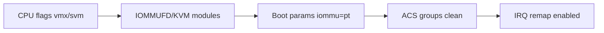

# Verify VT-x / KVM / IOMMU & ACS (Kernel 7.1+, systemd 261+)

> [!abstract] Goal
> Guarantee firmware and the modern stack (KVM + `IOMMUFD`) are cooperating **before** touching libvirt. This note is the pre-flight gate `05_virtio_iso.py:verify_kvm_capability` and `15_*.py:enumerate_pci` codify.

## Step 0 — UEFI/BIOS

| Setting | Value | Why |
|---|---|---|
| VT-x / SVM | **Enabled** | `vmx`/`svm` flags → `/dev/kvm` |
| VT-d / AMD-Vi | **Enabled** | IOMMU DMA remapping |
| Above 4G Decoding | **Enabled** | >16 GiB BAR (large dGPU) |
| ReBAR / SAM | **Enabled** | Zero-bottleneck BAR |
| ACS | **Enabled** if exposed | Physical PCIe isolation (not all boards expose) |
| SR-IOV | **Enabled** only if using vGPU | — |

## Step 1 — CPU flags

```bash
lscpu | grep -i virtualization
# Intel: VT-x   AMD: AMD-V
grep -m1 '^flags' /proc/cpuinfo | tr ' ' '\n' | grep -E '^vmx$|^svm$'
ls -l /dev/kvm   # crw-rw-rw- 1 root kvm
```

## Step 2 — Kernel modules (KVM + IOMMUFD)

```bash
zgrep -E "CONFIG_KVM=|CONFIG_VFIO_PCI=|CONFIG_IOMMUFD=" /proc/config.gz
# y = builtin, m = module (Arch default m, loaded on demand)
lsmod | grep -iE 'kvm|vfio|iommu'
```

> [!info] IOMMUFD vs Type1
> Since Kernel 7.1, VFIO Type1 is deprecated in favor of **IOMMUFD** for memory management. QEMU 10+ defaults to `iommufd` backend where available. This is guest memory-management future; host isolation steps below unchanged.

## Step 3 — Boot params

```bash
cat /proc/cmdline | tr ' ' '\n' | grep -E '^(intel_iommu|amd_iommu|iommu|vfio)'
# Intel expects: intel_iommu=on + iommu=pt
# AMD expects: iommu=pt only (amd_iommu=on is ignored — see Grub Kernal Parameters)
```

## Step 4 — IOMMU groups (the crucial test)

```bash
for d in /sys/kernel/iommu_groups/*/devices/*; do
  n=${d#*/iommu_groups/*}; n=${n%%/*}
  printf 'IOMMU Group %s ' "$n"
  lspci -nns "${d##*/}"
done
```

> [!info] How to read
> - **Success:** target dGPU + its audio/xHCI/UCSI are alone (PCIe bridges in same group are irrelevant).
> - **Failure:** dGPU shares group with NVMe/SATA/LAN from other slots. Fix: move card to CPU-attached x16 slot or board with real ACS. **Do NOT** apply ACS-override patches on hosts handling data you care about — they fake isolation.

## Step 5 — Interrupt remapping

```bash
sudo dmesg | grep -i -e 'remapping' -e 'DMAR-IR' -e 'AMD-Vi'
# Intel: DMAR-IR: Enabled IRQ remapping in x2apic mode
# AMD:   AMD-Vi: Interrupt remapping enabled
```

## Flow



On failure, see [[Verify VT-x and Kernel Modules and IOMMU|Troubleshooting]] and [[Host PC  Preparation for GPU isolation]]`:§1.2` for the scripts' `audit_groups`/`audit_id_collisions` panels.
