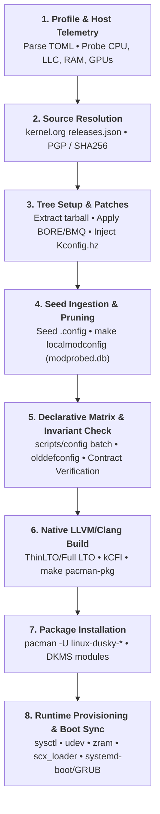
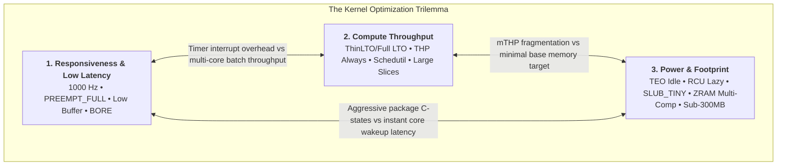
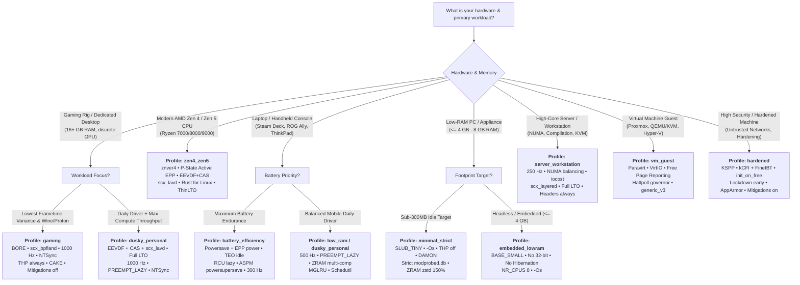
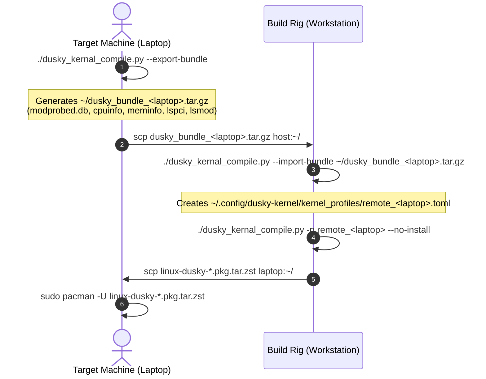
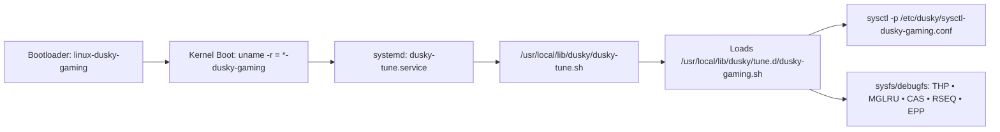

# Dusky Kernel Compiler (v6.0.0) — Architecture, Configuration & Profile Engineering Manual

> [!abstract] Executive Summary
> `dusky_kernal_compile.py` is a specialized kernel compilation and optimization engine for Arch Linux targeting **Linux 7.2+ and 7.3-rc** (September 2026 specification). It eliminates generic distribution overhead by bridging **compile-time hardware tailoring** (`scripts/config`, Clang ThinLTO, `modprobed-db`) with **boot-time system provisioning** (`systemd`, `udev`, `sysctl`, `zram-generator`, `scx_loader`).

---

## Quick Navigation

- [[#1. Executive Summary & Engine Pipeline|1. Executive Summary & Engine Pipeline]]
- [[#2. Architecture Taxonomy & Modern Kernel Evolution|2. Architecture Taxonomy & Linux 7.2+/7.3 Evolution]]
- [[#3. The Kernel Optimization Trilemma|3. The Kernel Optimization Trilemma]]
- [[#4. Command-Line Interface & Operational Modes|4. CLI & Operational Modes]]
- [[#5. Comprehensive Section & Parameter Reference|5. Parameter Reference (18 Sections)]]
  - `[meta]` • `[release]` • `[scheduler]` • `[cache]` • `[rseq]` • `[cpu]` • `[timing]` • `[memory]` • `[compiler]` • `[security]` • `[gaming]` • `[storage]` • `[power]` • `[network]` • `[modules]` • `[boot]` • `[verify]` • `[dusky]`
- [[#6. Cross-Subsystem Incompatibilities & Conflict Rules|6. Incompatibilities & Conflict Rules]]
- [[#7. Decision Tree, Profile Catalog & Production Templates|7. Decision Tree, Profiles & TOML Templates]]
- [[#8. Advanced Engineering Workflows|8. Advanced Workflows (Remote Bundles, AutoFDO, Uninstall)]]
- [[#9. Step-by-Step Operational Runbook|9. Operational Runbook]]

---

## 1. Executive Summary & Engine Pipeline

The Dusky compilation pipeline executes in strict chronological stages to produce twin Arch Linux native packages: `linux-dusky-<flavor>` and `linux-dusky-<flavor>-headers`.



### Filesystem Layout & Storage Topology

| Path Category | Default Location | Environment Override | Purpose |
| :--- | :--- | :--- | :--- |
| **Engine Script** | `~/user_scripts/kernel/dusky_kernal_compile.py` | — | Core compiler & provisioning engine |
| **System Profiles** | `~/user_scripts/kernel/kernel_profiles/` | `DUSKY_PROFILES_DIR` | Shared TOML profile recipes |
| **User Profiles** | `~/.config/dusky-kernel/kernel_profiles/` | — | User-authored custom profiles |
| **Config Snapshots**| `~/.config/dusky-kernel/configs/` | — | Per-profile `.config` snapshots |
| **Build Root** | `/mnt/zram1/dusky_kernel` or `~/.cache/dusky-kernel/` | `DUSKY_BUILD_DIR` | Working build tree (`src`, `tarballs`, `seeds`) |
| **Patch Cache** | `~/.cache/dusky-kernel/patches/` | `DUSKY_PATCH_CACHE` | Cached out-of-tree patches (BORE/BMQ) |
| **ThinLTO Cache** | `~/.cache/dusky-kernel/thinlto-cache/` | `DUSKY_THINLTO_CACHE`| Persistent LLVM ThinLTO object store |
| **Package Output** | `~/.cache/dusky-kernel/packages/` | `DUSKY_PKGDEST` | Built `.pkg.tar.zst` packages |
| **State & Logs** | `~/.local/state/dusky-kernel/logs/` | `XDG_STATE_HOME` | Plain-text build journals & history |
| **Hardware DB** | `~/.config/modprobed.db` | — | Active modules database (`modprobed-db`) |
| **Runtime Libs** | `/usr/local/lib/dusky/` | — | Dispatcher & tuning scripts (`dusky-tune.sh`) |
| **Runtime Manifest**| `/etc/dusky/manifest-<flavor>.txt` | — | Deployed file index for clean uninstallation |

---

## 2. Architecture Taxonomy & Modern Kernel Evolution

### 2.1. Subsystem Architecture Map

```mermaid
%%{init: {'theme': 'base', 'themeVariables': {'darkMode': true, 'primaryTextColor': '#ffffff', 'lineColor': '#60a5fa'}}}%%
flowchart TD
    ROOT(["<b>Dusky Kernel Architecture (Linux 7.2+ / 7.3-rc)</b><br>Modular Engine Core & Hardware Tailoring"]):::rootNode

    subgraph CPU["⚡ 1. CPU & Scheduling Core"]
        direction TB
        C1["<b>Core Scheduler Engines</b><br>• Upstream EEVDF (7.x Default)<br>• BORE (Burst-Oriented Response)<br>• BMQ (Project C O(1) Bitmap)"]
        C2["<b>sched_ext (SCX) BPF Classes</b><br>• scx_lavd (Handhelds & Gaming)<br>• scx_bpfland (Interactive Desktop)<br>• scx_layered (Cgroup Workstations)<br>• scx_cosmos / scx_p2dq (Cache-Aware)"]
        C3["<b>Cache-Aware Scheduling (CAS)</b><br>• CONFIG_SCHED_CACHE<br>• LLC / CCX Domain Affinity<br>• Communicating Task Co-location"]
        C4["<b>Hardware P-State Autonomy</b><br>• AMD P-State Active EPP (CPPC v2)<br>• Intel HWP & Thread Director (HFI)<br>• Schedutil PELT Governor"]
    end

    subgraph TIMING["⏱️ 2. Clock, Timing & Preemption"]
        direction TB
        T1["<b>Interrupt Cadence (HZ)</b><br>• 1000 Hz: Minimum input & frame latency<br>• 500/600 Hz: High-refresh desktop sweet spot<br>• 300 Hz: Video framerate sync & battery<br>• 250 Hz: Sustained batch throughput"]
        T2["<b>Preemption Architecture</b><br>• PREEMPT_LAZY: 7.x desktop standard<br>• PREEMPT_FULL: Lowest audio buffer underruns<br>• PREEMPT_RT: Deterministic hard real-time<br>• PREEMPT_DYNAMIC: Boot & debugfs runtime toggle"]
        T3["<b>Tickless NO_HZ & RCU</b><br>• NO_HZ_IDLE: Suppress ticks on idle cores<br>• NO_HZ_FULL: Adaptive ticks (isolated cores)<br>• RCU_LAZY: Batch 10s idle RCU callbacks"]
        T4["<b>Time-Slice Extensions</b><br>• CONFIG_RSEQ_SLICE_EXTENSION<br>• 10 µs critical section extension"]
    end

    subgraph MEMORY["🧠 3. Memory & Storage Architecture"]
        direction TB
        M1["<b>Virtual Memory & Reclaim</b><br>• Multi-Gen LRU (MGLRU) enabled<br>• Concurrent Per-VMA read/write locks<br>• DAMON proactive page reclaim<br>• Watermark scale factor tuning"]
        M2["<b>Compressed Memory Swap</b><br>• ZRAM Multi-Comp: LZ4/Zstd primary<br>• Hourly idle-page recompression timer<br>• zswap write-through disk cache"]
        M3["<b>Paging & Allocator Defenses</b><br>• Transparent Hugepages (THP / mTHP)<br>• SLUB standard vs SLUB_TINY (<= 4 GB)<br>• SLAB_BUCKETS security isolation"]
        M4["<b>Block Layer & Filesystems</b><br>• NVMe IOPOLL sub-2µs completion<br>• Bypass software I/O queues on NVMe<br>• MQ-Deadline (SATA) & BFQ (Rotational)"]
    end

    subgraph TOOLCHAIN["🛡️ 4. Toolchain, Security & Gaming"]
        direction TB
        S1["<b>LLVM/Clang 21+ Toolchain</b><br>• ThinLTO with persistent disk cache<br>• Monolithic Full LTO for build boxes<br>• AutoFDO & Propeller basic-block PGO<br>• In-tree Rust-for-Linux support"]
        S2["<b>Exploit Defenses</b><br>• Clang kCFI with hardware FineIBT<br>• Hardened usercopy bounds checking<br>• Stackprotector strong & random kstack<br>• Early lockdown LSM & AppArmor"]
        S3["<b>Low-Latency Gaming & Wine</b><br>• In-tree NTSync driver (/dev/ntsync)<br>• UCLAMP utilization clamping<br>• Split-lock mitigation penalty bypass<br>• 2B vm.max_map_count ceiling"]
        S4["<b>High-Throughput Network</b><br>• TCP BBRv3 congestion pacing<br>• FQ / CAKE bufferbloat elimination<br>• Multipath TCP (MPTCP) & AF_XDP"]
    end

    ROOT ==> CPU
    ROOT ==> TIMING
    ROOT ==> MEMORY
    ROOT ==> TOOLCHAIN

    classDef rootNode fill:#1e1b4b,stroke:#818cf8,stroke-width:3px,color:#ffffff,font-size:15px;
    classDef cpuCard fill:#0f172a,stroke:#38bdf8,stroke-width:2px,color:#ffffff;
    classDef timeCard fill:#0f172a,stroke:#fbbf24,stroke-width:2px,color:#ffffff;
    classDef memCard fill:#0f172a,stroke:#c084fc,stroke-width:2px,color:#ffffff;
    classDef toolCard fill:#0f172a,stroke:#34d399,stroke-width:2px,color:#ffffff;

    class C1,C2,C3,C4 cpuCard;
    class T1,T2,T3,T4 timeCard;
    class M1,M2,M3,M4 memCard;
    class S1,S2,S3,S4 toolCard;
```



### 2.2. Linux 7.2+ / 7.3 Modern Standards vs. Obsolete Pre-7.0 Paradigms

> [!important] Hard Version Floor
> Dusky enforces a strict minimum floor of **Linux 7.2**. Legacy kernel interfaces prior to Linux 7.0 are completely unsupported.

| Subsystem | Obsolete Pre-7.0 Paradigm | Modern Linux 7.2+ / 7.3 Architecture in Dusky | Architectural Advantage |
| :--- | :--- | :--- | :--- |
| **CPU Scheduling** | Completely Fair Scheduler (CFS) with static latency target heuristics. | **EEVDF** (`CONFIG_SCHED_FAIR`) + **sched_ext** (`CONFIG_SCHED_CLASS_EXT`) dynamic BPF schedulers. | Guaranteed virtual runtime deadlines ($d_i = v_i + \frac{q_i}{w_i}$); dynamic kernel scheduling in userspace eBPF. |
| **Cache Balancing**| NUMA-only coarse scheduling; oblivious to Last-Level Cache CCX splits. | **Cache-Aware Scheduling (CAS)** (`CONFIG_SCHED_CACHE`). | Co-locates communicating threads within the same physical L3 cache slice, eliminating inter-CCX fabric stalls. |
| **Preemption** | Forced binary choice between `PREEMPT_VOLUNTARY` (throughput) and `PREEMPT_FULL` (latency). | **PREEMPT_LAZY** (`CONFIG_PREEMPT_LAZY`). | Dual-flag preemption: urgent RT tasks preempt immediately (`TIF_NEED_RESCHED`), while fair tasks run to slice boundaries. |
| **Windows Sync** | Slow `wineserver` IPC roundtrips or experimental out-of-tree patches. | **In-tree NTSync Driver** (`CONFIG_NTSYNC=m`, `/dev/ntsync`). | Native kernel emulation of Windows NT mutexes, semaphores, and event objects; accelerates DX11/DX12 frametimes. |
| **Memory Reclaim**| Two-list LRU (Active/Inactive) suffering severe lock contention and page thrashing. | **Multi-Gen LRU (MGLRU)** (`CONFIG_LRU_GEN=y`). | Generational aging via multi-level page table scans; reduces reclaim CPU overhead and prevents OOM freezing. |
| **Slab Allocator** | Legacy SLAB allocator (`CONFIG_SLAB`, removed in Linux 6.8). | **SLUB** exclusively, with **SLUB_TINY** (`CONFIG_SLUB_TINY`) or **SLAB_BUCKETS** hardening. | 20–60 MB lower base footprint (`SLUB_TINY`) or complete heap spray mitigation buckets (`SLAB_BUCKETS`). |
| **P-State Control**| Legacy `acpi-cpufreq` software polling loops (10 ms intervals). | **Autonomous CPPC v2 EPP** (`amd_pstate=active` / `intel_pstate`). | Hardware autonomy adjusts clock frequencies in sub-millisecond hardware loops based on autonomous EPP hints. |
| **Compiler / LTO** | GCC monolithic LTO (high RAM usage, fragile module linking). | **LLVM/Clang 21+ ThinLTO** (`CONFIG_LTO_CLANG_THIN`) with persistent caching. | 95–99% of monolithic Full LTO codegen performance with incremental compilation and parallel multi-core linking. |
| **Kernel CFI** | Legacy GCC plugins or disabled control flow protection. | **Clang kCFI** (`CONFIG_CFI_CLANG`) paired with hardware **FineIBT**. | Forward-edge indirect call protection via 4-byte type hashes without breaking module loading or BPF JIT compilation. |
| **Compressed Swap**| Single-algorithm ZRAM (forced compromise between ratio and CPU overhead). | **ZRAM Multi-Compression** (`CONFIG_ZRAM_MULTI_COMP`). | High-speed primary compressor (LZ4/Zstd) paired with background idle-page recompression (Zstd level 9–11). |

---

## 3. The Kernel Optimization Trilemma

Every kernel optimization balances three competing architectural forces:



1. **Responsiveness vs. Throughput**: A 1000 Hz timer tick and `PREEMPT_FULL` guarantee immediate response to user input and eliminate audio buffer underruns (PipeWire/JACK). However, the frequent timer interrupts and context switches evict L1/L2 caches, causing a **3% to 8% penalty** in sustained multi-core workloads (compilation, rendering).
2. **Throughput vs. Memory Footprint**: Transparent Huge Pages (`THP=always`) and multi-size THP (mTHP) drastically reduce TLB misses, boosting game frame pacing and JVM runtimes. However, allocating 2 MB chunks for small data structures increases internal fragmentation, inflating memory footprint on 4 GB–8 GB machines.
3. **Responsiveness vs. Battery Endurance**: Pinning maximum frequencies (`performance` governor, `EPP=performance`) and high tick rates wake CPU cores hundreds of times per second. This prevents CPU packages from settling into deep low-power C-states (C8/C10), increasing idle power draw by **1.5W to 4W** on laptops.

---

## 4. Command-Line Interface & Operational Modes

### Syntax
```bash
./dusky_kernal_compile.py [MODES] [OVERRIDES] [BEHAVIOUR]
```

### Core Execution Modes

| Command Flag | Description |
| :--- | :--- |
| `-p`, `--profile NAME` | Selects profile to build (launches interactive picker if omitted). |
| `-l`, `--list-profiles` | Lists all discovered profiles, priorities, channels, and scheduler classes. |
| `--show` | Displays the fully resolved configuration for a profile. |
| `--dump-toml` | Used with `--show`: outputs the resolved profile as clean TOML. |
| `--spec` | Prints the complete profile schema specification with types and defaults. |
| `--doctor` | Runs complete diagnostics: toolchains, host telemetry, microcode, bootloaders. |
| `--print-matrix` | Evaluates and prints the Kconfig matrix diff against upstream defaults. |
| `--configure-only` | Halts execution immediately after configuration and contract verification. |
| `--clean [WHAT]` | Prunes caches: `all`, `src`, `tarballs`, `patches`, `packages`, `thinlto`, `logs`, `seeds`. |
| `--write-default-profiles` | Emits all 10 built-in reference profiles into the profile directory. |
| `--export-bundle [FILE]` | Exports local hardware telemetry, `modprobed.db`, and PCI inventory for remote builds. |
| `--import-bundle FILE` | Ingests a remote bundle and generates a customized `remote_<host>` profile. |
| `--uninstall FLAVOR` | Cleanly removes `linux-<flavor>{,-headers}`, bootloader entries, and runtime files. |
| `--fdo-record SECONDS` | Records branch execution profiles using Linux `perf` for Clang AutoFDO. |
| `--fdo-propeller` | Used with `--fdo-record`: generates Propeller basic-block layout profiles. |
| `--menu` | Opens the full-screen interactive terminal configuration and management menu. |

### Command-Line Overrides

Overrides apply dynamically to the loaded profile without modifying the TOML file on disk:

```bash
--cpu-arch ARCH          # native | generic_v2 | generic_v3 | generic_v4 | znver4 | ...
--modules-mode MODE      # strict | expanded
--toolchain TC           # llvm | gcc
--lto TYPE               # none | thin | full
--channel CHAN           # mainline | stable | longterm
--scheduler SCHED        # eevdf | bore | bmq
--scx DAEMON             # none | scx_lavd | scx_bpfland | scx_layered | ...
--headers POLICY         # auto | always | never
--no-headers             # Alias for --headers never
--footprint TIER         # standard | lean | minimal | embedded
--pin VERSION            # Exact kernel version (e.g. 7.2.4, 7.3-rc2)
-j, --jobs N             # Compilation parallelism (0 = auto-detected)
--no-rust                # Disables Rust-for-Linux support
```

### Build Behaviour Flags

```bash
--build-dir DIR          # Override build root directory
--wizard                 # Always execute the 11-step granular interactive wizard
--no-prompt              # Never prompt for wizard confirmation; build immediately
--fresh                  # Force fresh re-extraction of the kernel source tree
--seed-config FILE       # Ingest seed configuration from a custom file
--no-install             # Compile Arch packages into PKGDEST without installing
--kernel-install         # Register kernel via systemd kernel-install(8)
--force                  # Bypass bare_metal_only virtualization checks
-y, --yes                # Automatically accept defaults for all prompts
-v, --verbose            # Enable detailed debug logging
--json                   # Output structured JSON for --doctor and --show
--no-color               # Strip ANSI escape sequences from console output
```

### Interactive Wizard Navigation & Review Controls

When entering the granular configuration wizard (`--wizard` or selecting `[n]` at the defaults prompt), the engine provides non-linear "time-travel" navigation so mistakes can be undone instantly without restarting:

| Signal Key | Action | Scope & Behavior |
| :---: | :--- | :--- |
| `b` | **Back** | Steps back to the immediate previous question, restores its previous value, and clears its diff entry. |
| `m` | **Menu Jump** | Displays an indexed menu of all 11 wizard sections to jump directly to any subsystem. |
| `s` | **Skip Section** | Skips all remaining questions in the active section, keeping their defaults. |
| `!` | **Accept All** | Accepts all remaining defaults across the entire wizard and moves directly to validation. |
| `?` | **Help** | Displays contextual architectural help for the current parameter and its allowed values. |

> [!tip] Non-Destructive Pre-Build Review Gate
> Before launching compilation, the engine displays the complete resolved configuration diff and enters an interactive gate: `Proceed with this configuration? [Y]es / [e]dit / [n]o`.
> Choosing `[e]dit` allows you to revisit the wizard or jump straight to any section to modify options, preventing accidental builds without discarding your earlier answers.

### Exit Codes Contract

| Exit Code | Classification | Cause & Remedy |
| :---: | :--- | :--- |
| `0` | **Success** | Build completed, packages generated and/or installed. |
| `1` | **Generic Error** | Unspecified runtime failure or missing binary. Check logs. |
| `2` | **Profile Error** | Schema validation failed, missing required keys, or invalid range. |
| `3` | **Network Error** | Download failure from kernel.org or release mirrors. Check network. |
| `4` | **Verify Error** | Invariant contract violation (e.g., missing BTF, NTSync, or SCHED_CLASS_EXT). |
| `5` | **Build Error** | Source compilation error, patch rejection, or link-time failure. |
| `6` | **Dependency Error**| Essential host tool missing (`clang`, `pahole`, `bc`, `cpio`). |
| `130` | **Aborted** | Process interrupted by user (`Ctrl-C`); child process groups reaped. |

---

## 5. Comprehensive Section & Parameter Reference

### 5.1. `[meta]` — Package Metadata & Portability

| Key | Type | Default | Choices / Bounds | Description & Architectural Impact |
| :--- | :---: | :---: | :---: | :--- |
| `name` | `str` | `""` | `[A-Za-z0-9_.-]+` | **Required**. Profile ID referenced via `--profile <name>`. |
| `description` | `str` | `""` | Any string | Human-readable description displayed in pickers and tables. |
| `suffix` | `str` | `""` | `[a-z0-9][a-z0-9-]*` | **Required**. Appended to `LOCALVERSION` (`CONFIG_LOCALVERSION`) and packages (`linux-<suffix>`). |
| `priority` | `int` | `50` | `1`–`100` | Sorting precedence in profile selectors (lower numbers sort first). |
| `tags` | `list`| `[]` | Strings | Free-form categorisation tags (e.g. `["gaming", "laptop"]`). |
| `bare_metal_only`| `bool`| `false` | `true`, `false` | If `true`, strips all hypervisor and paravirt drivers (`CONFIG_HYPERVISOR_GUEST`, `CONFIG_PARAVIRT`, `CONFIG_KVM_GUEST`, `CONFIG_VIRTIO*`). Will fail to boot inside VMs unless `--force` is used. |
| `portable_package`| `bool`| `false` | `true`, `false` | Builds for distribution across multiple machines. **Strictly forbids** `cpu.arch = "native"` to prevent `#UD` (Invalid Opcode) faults. |

---

### 5.2. `[release]` — Source Channels & Verification

| Key | Type | Default | Choices / Bounds | Description & Architectural Impact |
| :--- | :---: | :---: | :---: | :--- |
| `channel` | `str` | `"stable"` | `mainline`, `stable`, `longterm` | Target branch tracked on kernel.org. `mainline` tracks Linus' master tree (Linux 7.3-rc). |
| `pin` | `str` | `""` | Semantic version | Pins an exact release (e.g. `"7.2.4"`, `"7.3-rc2"`), bypassing channel discovery. |
| `allow_rc` | `bool`| `true` | `true`, `false` | Permits downloading and building Release Candidate tarballs (`-rcX`). |
| `min_version` | `str` | `"7.2"` | Major.Minor | Hard version floor. Rejects older trees lacking required 7.2+ interfaces. |
| `require_signature`| `bool`| `true` | `true`, `false` | Enforces cryptographic PGP signature validation using kernel.org release keys. |

---

### 5.3. `[scheduler]` — CPU Scheduling Core

| Key | Type | Default | Choices / Bounds | Description & Architectural Impact |
| :--- | :---: | :---: | :---: | :--- |
| `type` | `str` | `"eevdf"` | `eevdf`, `bore`, `bmq` | Base scheduler engine: upstream **EEVDF** (`CONFIG_SCHED_FAIR`), FireLzrd's **BORE** (`CONFIG_SCHED_BORE`), or Alfred Chen's **BMQ** (`CONFIG_SCHED_BMQ`). |
| `scx` | `str` | `"none"` | `none`, `scx_lavd`, `scx_bpfland`, `scx_layered`, `scx_rusty`, `scx_flash`, `scx_p2dq`, `scx_cosmos` | Dynamic BPF scheduler daemon loaded on top of `sched_ext`. |
| `scx_flags` | `str` | `""` | Shell tokens | Arguments passed to the SCX daemon (e.g. `"--autopilot"`, `"-m performance"`). |
| `scx_enable_class`| `bool`| `true` | `true`, `false` | Compiles `CONFIG_SCHED_CLASS_EXT=y` (+BTF and BPF JIT support). |
| `require_patch` | `bool`| `false` | `true`, `false` | Halts the build immediately if an out-of-tree scheduler patch fails to apply. |
| `allow_vanilla_fallback`| `bool`| `true` | `true`, `false` | Reverts cleanly to upstream EEVDF if a scheduler patch rejects. |
| `autogroup` | `bool`| `true` | `true`, `false` | `CONFIG_SCHED_AUTOGROUP`. Organises tasks by TTY session to prevent terminal builds from starving desktop interactivity. |
| `rt_group` | `bool`| `false` | `true`, `false` | `CONFIG_RT_GROUP_SCHED`. Limits real-time bandwidth. Set to `false` for pro-audio and gaming to eliminate PipeWire buffer underruns. |
| `sched_core` | `bool`| `false` | `true`, `false` | `CONFIG_SCHED_CORE`. SMT core scheduling for side-channel isolation. Incurs 10%–25% throughput loss; disable for single-user systems. |
| `patch_sources`| `list`| `["cachyos", "upstream_author", "tkg"]` | Resolvers | Ordered resolvers for fetching out-of-tree scheduler patches (`cachyos`, `upstream_author`, `tkg`, local path, or URL). |

> [!note] EEVDF Mathematical Model
> EEVDF balances tasks using two metrics:
> 1. **Eligibility Time**: $V(t) \ge v_i$ (task is eligible to run when its virtual runtime does not exceed system virtual time).
> 2. **Virtual Deadline**: $d_i = v_i + \frac{q_i}{w_i}$ (prioritises tasks with earlier deadlines, where $q_i$ is allocation slice and $w_i$ is weight).

---

### 5.4. `[cache]` — Cache-Aware Scheduling (CAS)

| Key | Type | Default | Choices / Bounds | Description & Architectural Impact |
| :--- | :---: | :---: | :---: | :--- |
| `sched_cache` | `bool`| `true` | `true`, `false` | `CONFIG_SCHED_CACHE`. Directs scheduler load balancing to respect Last-Level Cache (L3/LLC) domain boundaries. |
| `llc_aggr_tolerance`| `int` | `1` | `0`–`100` | `0` = disabled. `1` = strict (co-locates tasks only if combined RSS fits in LLC). `>1` = relaxed aggregation. |
| `llc_aggr_cap` | `int` | `-1` | `-1`–`100` | Runqueue depth cap on an LLC domain before spilling across CCXs. `-1` uses kernel defaults. |
| `persist` | `bool`| `true` | `true`, `false` | Installs boot-time service (`dusky-tune.service`) to persist CAS sysfs/debugfs tunables across reboots. |

---

### 5.5. `[rseq]` — Restartable Sequences Slice Extensions

| Key | Type | Default | Choices / Bounds | Description & Architectural Impact |
| :--- | :---: | :---: | :---: | :--- |
| `slice_extension` | `bool`| `true` | `true`, `false` | `CONFIG_RSEQ_SLICE_EXTENSION`. Allows threads inside lockless per-CPU critical sections to request a short preemption delay. |
| `slice_ext_nsec` | `int` | `10000` | `1000`–`100000` | Maximum preemption extension duration in nanoseconds (default: 10 µs). |

---

### 5.6. `[cpu]` — Microarchitecture, P-State Autonomy & Mitigations

| Key | Type | Default | Choices / Bounds | Description & Architectural Impact |
| :--- | :---: | :---: | :---: | :--- |
| `arch` | `str` | `"native"` | `native`, `generic_v2`–`v4`, `znver1`–`v5`, `alderlake`–`arrowlake`, etc. | Target CPU architecture. `native` generates `-march=native` (`CONFIG_X86_NATIVE_CPU`). |
| `march` | `str` | `""` | Compiler flags | Optional compiler flags appended directly to `KCFLAGS`. |
| `governor` | `str` | `"schedutil"`| `schedutil`, `performance`, `powersave`, `ondemand`, `conservative` | Default CPU frequency scaling governor (`CONFIG_CPU_FREQ_DEFAULT_GOV_*`). |
| `amd_pstate` | `str` | `"active"` | `active`, `guided`, `passive`, `disable`, `undefined` | AMD P-State mode (`CONFIG_X86_AMD_PSTATE_DEFAULT_MODE`). `active` enables autonomous hardware EPP. |
| `epp` | `str` | `"balance_performance"` | `default`, `performance`, `balance_performance`, `balance_power`, `power` | Hardware Energy-Performance Preference register hint applied at boot. |
| `mitigations` | `str` | `"on"` | `on`, `off`, `nosmt` | CPU vulnerability mitigations (`CONFIG_CPU_MITIGATIONS`). `"off"` removes runtime overheads on trusted machines. |
| `nr_cpus` | `int` | `0` | `0`–`8192` | `CONFIG_NR_CPUS`. `0` auto-detects host thread count rounded up to nearest multiple of 8. |
| `smt` | `bool`| `true` | `true`, `false` | Enables Simultaneous Multi-Threading / Hyper-Threading (`CONFIG_SCHED_SMT=y`). |
| `mce` | `bool`| `true` | `true`, `false` | Machine Check Exception handling (`CONFIG_X86_MCE`) for hardware error logging. |
| `prefcore` | `bool`| `true` | `true`, `false` | Preferred core awareness (`CONFIG_SCHED_MC_PRIO`) for boosting highest-binned silicon cores. |
| `compat32` | `bool`| `true` | `true`, `false` | `CONFIG_IA32_EMULATION`. Required for Steam, 32-bit Wine/Proton games, and legacy binaries. |

---

### 5.7. `[timing]` — Clock Cadence, PREEMPT_LAZY & Tickless Modes

| Key | Type | Default | Choices / Bounds | Description & Architectural Impact |
| :--- | :---: | :---: | :---: | :--- |
| `hz` | `int` | `1000` | `100`, `250`, `300`, `500`, `600`, `750`, `1000` | Timer interrupt frequency (`CONFIG_HZ_*`). Non-standard rates (500, 600, 750) are injected via `kernel/Kconfig.hz`. |
| `tickless` | `str` | `"idle"` | `periodic`, `idle`, `full` | `idle` (`CONFIG_NO_HZ_IDLE`) stops ticks on idle CPUs. `full` (`CONFIG_NO_HZ_FULL`) requires `nohz_full=` parameter. |
| `preempt` | `str` | `"lazy"` | `lazy`, `full`, `rt` | Preemption model (`CONFIG_PREEMPT_LAZY`, `CONFIG_PREEMPT`, `CONFIG_PREEMPT_RT`). |
| `preempt_dynamic`| `bool`| `true` | `true`, `false` | `CONFIG_PREEMPT_DYNAMIC`. Allows changing preemption at boot (`preempt=`) or runtime via debugfs. |

> [!info] PREEMPT_LAZY Architectural Mechanism
> In Linux 7.2+, `PREEMPT_LAZY` decouples urgent rescheduling from normal preemption:
> $$\text{Preemption Trigger} \rightarrow \begin{cases} \mathbf{TIF\_NEED\_RESCHED} & \text{Urgent: Real-Time tasks preempt immediately} \\ \mathbf{TIF\_NEED\_RESCHED\_LAZY} & \text{Fair: Tasks run until slice boundary or voluntary yield} \end{cases}$$

---

### 5.8. `[memory]` — Paging, Multi-Gen LRU, Compressed Swap & Footprints

| Key | Type | Default | Choices / Bounds | Description & Architectural Impact |
| :--- | :---: | :---: | :---: | :--- |
| `footprint` | `str` | `"standard"`| `standard`, `lean`, `minimal`, `embedded` | Footprint tier. Bundles progressive Kconfig reductions for low-RAM systems. |
| `thp` | `str` | `"madvise"` | `always`, `madvise`, `never` | Transparent Huge Pages mode (`CONFIG_TRANSPARENT_HUGEPAGE_*`). |
| `thp_defrag` | `str` | `"defer+madvise"` | `always`, `defer`, `defer+madvise`, `madvise`, `never` | Memory defragmentation strategy. `defer+madvise` prevents synchronous frame stalls. |
| `thp_shmem` | `str` | `"never"` | `always`, `within_size`, `advise`, `never` | Transparent huge pages policy for shared memory and `tmpfs`. |
| `mglru` | `bool`| `true` | `true`, `false` | `CONFIG_LRU_GEN=y`. Multi-Gen LRU replacement for legacy two-list page reclamation. |
| `mglru_mask` | `int` | `7` | `0`–`7` | MGLRU bitmask (`1` = anon, `2` = file, `4` = page-table scan). `7` enables all paths. |
| `mglru_min_ttl_ms`| `int` | `1000` | `0`–`60000` | Minimum generational TTL in milliseconds to protect active sets from thrashing. |
| `swap_backend` | `str` | `"zram"` | `zram`, `zswap`, `none` | Compressed swap architecture (`CONFIG_ZRAM` vs `CONFIG_ZSWAP`). |
| `zram_algo` | `str` | `"zstd"` | `zstd`, `lz4`, `lz4hc`, `lzo-rle` | Primary ZRAM compression algorithm (`CONFIG_ZRAM_DEF_COMP_*`). |
| `zram_recomp_algo`| `str` | `"zstd"` | `zstd`, `lz4`, `lz4hc`, `lzo-rle` | Secondary recompression algorithm for idle pages (`CONFIG_ZRAM_MULTI_COMP`). |
| `zram_size_pct` | `int` | `100` | `10`–`400` | ZRAM device capacity as a percentage of physical RAM. |
| `zram_multi_comp`| `bool`| `true` | `true`, `false` | Enables multi-compression streams and hourly idle recompression timer (`CONFIG_ZRAM_MULTI_COMP`). |
| `zswap_compressor`| `str` | `"zstd"` | `zstd`, `lz4`, `lz4hc`, `lzo` | Compression algorithm used by zswap (if `swap_backend = "zswap"`). |
| `zswap_max_pool_pct`| `int`| `25` | `5`–`80` | Maximum percentage of RAM zswap pool may occupy. |
| `swappiness` | `int` | `0` | `0`–`200` | `vm.swappiness`. `0` auto-selects: `180` for zram, `100` for zswap, `60` for none. |
| `vfs_cache_pressure`| `int`| `0` | `0`–`1000` | `0` auto-selects based on footprint tier (`50`–`70` for desktop, `150`–`200` for low-RAM). |
| `watermark_scale_factor`| `int`| `125` | `10`–`3000` | Distance between memory watermarks. Raising wakes `kswapd` earlier under pressure. |
| `watermark_boost_factor`| `int`| `0` | `0`–`30000` | High-order allocation boost. Set to `0` for zram/gaming to stop erratic reclaim bursts. |
| `compaction_proactiveness`| `int`| `0` | `0`–`100` | Proactiveness of background memory compaction (`kcompactd`). `0` = auto. |
| `dirty_bytes_mb`| `int` | `0` | `0`–`65536` | Hard dirty memory byte ceiling in MiB (`0` uses percentage-based defaults). |
| `slub_tiny` | `bool`| `false` | `true`, `false` | `CONFIG_SLUB_TINY`. Strips per-CPU partial slab lists. Saves 20–60 MB RAM; sacrifices scalability. |
| `slab_buckets` | `bool`| `false` | `true`, `false` | `CONFIG_SLAB_BUCKETS`. Hardens slab allocations into discrete size buckets. Incompatible with `slub_tiny`. |
| `per_vma_lock` | `bool`| `true` | `true`, `false` | `CONFIG_PER_VMA_LOCK`. Enables concurrent page faults across multiple threads. |
| `numa` | `bool`| `true` | `true`, `false` | Non-Uniform Memory Access architecture (`CONFIG_NUMA`). Disabling saves 15–35 MB. |
| `numa_balancing`| `bool`| `false` | `true`, `false` | Automatic page migration across NUMA nodes (`CONFIG_NUMA_BALANCING`). |
| `ksm` | `bool`| `true` | `true`, `false` | `CONFIG_KSM`. Kernel Samepage Merging memory deduplication framework. |
| `ksm_run` | `bool`| `false` | `true`, `false` | Automatically enables `ksmd` at boot via sysfs. |
| `damon` | `bool`| `false` | `true`, `false` | Data Access Monitoring (`CONFIG_DAMON`) and proactive page reclaim. |
| `page_reporting`| `bool`| `false` | `true`, `false` | Reports freed pages back to hypervisor (`CONFIG_PAGE_REPORTING`, VM guests only). |
| `hugetlbfs` | `bool`| `true` | `true`, `false` | Traditional HugeTLB filesystem support (`CONFIG_HUGETLBFS`). |
| `kallsyms_all` | `bool`| `true` | `true`, `false` | Embeds all symbols in kernel image (`CONFIG_KALLSYMS_ALL`). `false` saves 2–4 MB. |
| `memcg` | `bool`| `true` | `true`, `false` | Memory cgroup controller (`CONFIG_MEMCG`). Required for `systemd-oomd`. |
| `base_small` | `bool`| `false` | `true`, `false` | `CONFIG_BASE_SMALL`. Shrinks core kernel hash tables for minimal/embedded footprints. |
| `log_buf_shift` | `int` | `0` | `0`, `12`–`25` | Kernel log ring-buffer exponent (`CONFIG_LOG_BUF_SHIFT`). `0` auto-selects. |
| `tracing` | `str` | `"auto"` | `auto`, `full`, `minimal` | ftrace/kprobes/uprobes surface. `auto` enables full tracing only when an SCX daemon is selected. |
| `kexec` | `bool`| `true` | `true`, `false` | Kernel image fast reloading without BIOS reboot (`CONFIG_KEXEC`). |
| `ikconfig` | `bool`| `true` | `true`, `false` | Embeds `.config` into `/proc/config.gz` (`CONFIG_IKCONFIG_PROC`). |
| `systemd_oomd` | `bool`| `false` | `true`, `false` | Configures systemd PSI-based userspace out-of-memory daemon. |
| `trim_unused_ksyms`| `bool`| `false`| `true`, `false` | Drops unreferenced symbols from kernel binary. Requires `compiler.headers = "never"`. |
| `dead_code_elimination`| `bool`| `false`| `true`, `false` | `CONFIG_LD_DEAD_CODE_DATA_ELIMINATION` (inert on x86-64; kept for schema completeness). |

---

### 5.9. `[compiler]` — Toolchain, LTO, kCFI & Rust

| Key | Type | Default | Choices / Bounds | Description & Architectural Impact |
| :--- | :---: | :---: | :---: | :--- |
| `toolchain` | `str` | `"llvm"` | `llvm`, `gcc` | Compiler toolchain. `llvm` uses Clang/LLD (required for ThinLTO, kCFI, Rust, Polly). |
| `optimize` | `str` | `"o2"` | `o2`, `o3`, `size` | Optimization level. `o3` enables `CONFIG_CC_OPTIMIZE_FOR_PERFORMANCE_O3` with swing modulo scheduling (`-fmodulo-sched -fmodulo-sched-allow-regmoves -fivopts`), LLVM pipelining (`-mllvm -enable-pipeliner`), and x86 SIMD safety guards (`-mno-avx2 -fno-tree-vectorize`). |
| `polly` | `bool`| `false` | `true`, `false` | Clang Polly polyhedral loop optimizer (`CONFIG_POLLY_CLANG`). Optimizes multi-nested loop cache locality and data layout using `LLVMPolly.so`. |
| `lto` | `str` | `"thin"` | `none`, `thin`, `full` | Link-Time Optimization (`CONFIG_LTO_CLANG_THIN` / `CONFIG_LTO_CLANG_FULL`). |
| `thinlto_cache` | `bool`| `true` | `true`, `false` | Persists ThinLTO bitcode cache across compilation runs. |
| `thinlto_cache_size_gb`| `int`| `20` | `1`–`500` | Storage ceiling for pruning ThinLTO object cache. |
| `fdo` | `str` | `"none"` | `none`, `autofdo`, `autofdo_propeller` | Profile-Guided Optimization using hardware PMU counters. |
| `fdo_profile_dir`| `str`| `""` | Directory path | Directory holding `kernel.afdo` or Propeller profile files. |
| `kcfi` | `bool`| `false` | `true`, `false` | Forward-edge Control Flow Integrity (`CONFIG_CFI_CLANG`) with FineIBT (`CONFIG_X86_KERNEL_IBT`). |
| `debug_info` | `str` | `"reduced"`| `none`, `reduced`, `full` | Debug symbols level. `reduced` enables DWARF5 (required for BTF/eBPF). |
| `module_compress`| `str` | `"zstd"` | `zstd`, `xz`, `gzip`, `none` | In-tree kernel module compression algorithm (`CONFIG_MODULE_COMPRESS_*`). |
| `rust` | `bool`| `true` | `true`, `false` | Compiles Rust-for-Linux infrastructure (`CONFIG_RUST=y`). |
| `jobs` | `int` | `0` | `0`–`1024` | Parallel build threads (`0` auto-calculates from CPU cores and available RAM). |
| `headers` | `str` | `"auto"` | `auto`, `always`, `never` | Package headers policy. `auto` generates headers only if DKMS modules are installed on the host. |
| `modversions` | `bool`| `false` | `true`, `false` | `CONFIG_MODVERSIONS`. Generates symbol CRCs for external module ABI validation. |

> [!tip] Persistent DKMS Microarchitecture Inheritance
> Dusky injects target `-march` and `-mtune` flags directly into the top-level `Makefile` of the build tree (positioned directly before `$(KCFLAGS)`). When external DKMS modules (`nvidia-dkms`, `zfs-dkms`, `v4l2loopback-dkms`) build against `linux-headers`, they persistently inherit identical CPU microarchitecture tuning.

---

### 5.10. `[security]` — Hardening Profiles & Defenses

| Key | Type | Default | Choices / Bounds | Description & Architectural Impact |
| :--- | :---: | :---: | :---: | :--- |
| `profile` | `str` | `"balanced"`| `balanced`, `extreme`, `hardened` | Hardening baseline bundle: balanced desktop, extreme performance, or KSPP hardened. |
| `init_on_alloc` | `bool`| `true` | `true`, `false` | Zeroes pages and slabs on allocation (`CONFIG_INIT_ON_ALLOC_DEFAULT_ON`). |
| `init_on_free` | `bool`| `false` | `true`, `false` | Clears memory blocks immediately when freed (`CONFIG_INIT_ON_FREE_DEFAULT_ON`). Heavy overhead (5%–12%). |
| `hardened_usercopy`| `bool`| `true` | `true`, `false` | Validates bounds on `copy_to_user()` / `copy_from_user()` (`CONFIG_HARDENED_USERCOPY`). |
| `stackprotector`| `str` | `"strong"` | `strong`, `regular`, `none` | Injects canary protections to detect stack buffer overflows (`CONFIG_STACKPROTECTOR_STRONG`). |
| `slab_freelist_hardened`| `bool`| `true` | `true`, `false` | Obfuscates slab freelist pointers using XOR cookies (`CONFIG_SLAB_FREELIST_HARDENED`). |
| `slab_freelist_random`| `bool`| `true` | `true`, `false` | Randomizes slab allocation order (`CONFIG_SLAB_FREELIST_RANDOM`). |
| `randomize_kstack`| `bool`| `true` | `true`, `false` | Randomizes kernel stack offset on each syscall (`CONFIG_RANDOMIZE_KSTACK_OFFSET_DEFAULT`). |
| `ubsan_bounds` | `bool`| `true` | `true`, `false` | Runtime array index bounds validation (`CONFIG_UBSAN_BOUNDS`). |
| `apparmor` | `bool`| `false` | `true`, `false` | In-tree AppArmor Mandatory Access Control LSM (`CONFIG_SECURITY_APPARMOR`). |
| `selinux` | `bool`| `false` | `true`, `false` | In-tree SELinux module (`CONFIG_SECURITY_SELINUX`). |
| `lockdown_early`| `bool`| `false` | `true`, `false` | Enables early kernel lockdown (`CONFIG_SECURITY_LOCKDOWN_LSM_EARLY`). |
| `acknowledge_risk`| `bool`| `false` | `true`, `false` | **Required safety flag** when selecting `profile = "extreme"` or `cpu.mitigations = "off"`. |

---

### 5.11. `[gaming]` — Low-Latency & Gaming Optimizations

| Key | Type | Default | Choices / Bounds | Description & Architectural Impact |
| :--- | :---: | :---: | :---: | :--- |
| `ntsync` | `bool`| `true` | `true`, `false` | In-tree Windows NT synchronization primitive driver (`CONFIG_NTSYNC`). Replaces `wineserver` IPC. |
| `uclamp` | `bool`| `true` | `true`, `false` | Task utilization clamping (`CONFIG_UCLAMP_TASK`). Allows render threads to demand instant CPU frequencies. |
| `max_map_count` | `int` | `2147483642` | `65530`–`2147483642` | Sets `vm.max_map_count`. Prevents crashes in memory-mapped DirectX 12 games and anti-cheat modules. |
| `split_lock_mitigate`| `bool`| `false` | `true`, `false` | `false` disables kernel split-lock penalties, eliminating 10–20 ms stutters in games and emulators. |
| `controllers` | `bool`| `true` | `true`, `false` | Retains gamepad drivers (Xbox, PlayStation, DualSense, Nintendo Switch, Steam Controller, `uinput`). |

---

### 5.12. `[storage]` — NVMe IOPOLL & Block Schedulers

| Key | Type | Default | Choices / Bounds | Description & Architectural Impact |
| :--- | :---: | :---: | :---: | :--- |
| `nvme_poll_queues`| `int` | `0` | `0`–`128` | Sets `nvme.poll_queues`. Dedicated completion queues for sub-2 µs polling via `io_uring`. |
| `io_scheduler` | `str` | `"none"` | `none`, `mq-deadline`, `bfq`, `kyber`, `keep` | NVMe block I/O scheduler udev policy. `none` avoids queue overhead on fast NVMe drives. |
| `blk_wbt` | `bool`| `true` | `true`, `false` | `CONFIG_BLK_WBT`. Block writeback throttling to mitigate storage bufferbloat during heavy writes. |
| `iocost` | `bool`| `false` | `true`, `false` | Proportional I/O control model for cgroup v2 (`CONFIG_BLK_CGROUP_IOCOST`). |
| `extra_filesystems`| `list`| `[]` | Filesystem names | Additional filesystems compiled into the module set (e.g. `["btrfs", "f2fs", "xfs"]`). |

---

### 5.13. `[power]` — Idle Governors & Power Management

| Key | Type | Default | Choices / Bounds | Description & Architectural Impact |
| :--- | :---: | :---: | :---: | :--- |
| `wq_power_efficient`| `bool`| `false` | `true`, `false` | `CONFIG_WQ_POWER_EFFICIENT_DEFAULT`. Directs unbound workqueues to active cores, keeping idle cores asleep. |
| `cpu_idle_governor`| `str`| `"teo"` | `teo`, `menu`, `haltpoll` | cpuidle governor (`CONFIG_CPU_IDLE_GOV_TEO`). `teo` is optimal for tickless desktops/laptops. |
| `rcu_lazy` | `bool`| `false` | `true`, `false` | `CONFIG_RCU_LAZY`. Batches non-urgent RCU callbacks for up to 10s. Reduces idle battery draw by 5%–15%. |
| `energy_model` | `bool`| `false` | `true`, `false` | Exposes Energy Model tables for heterogeneous hybrid topologies (`CONFIG_ENERGY_MODEL`). |
| `suspend` | `bool`| `true` | `true`, `false` | Enables suspend-to-RAM (`CONFIG_SUSPEND`, `s2idle` / `deep`). |
| `hibernation` | `bool`| `true` | `true`, `false` | Enables suspend-to-disk with zstd image compression (`CONFIG_HIBERNATION`). |
| `pcie_aspm` | `str` | `"default"` | `default`, `powersave`, `powersupersave`, `performance` | PCIe Active State Power Management policy written to boot parameters. |
| `hda_power_save`| `int` | `0` | `0`–`3600` | Inactivity timeout in seconds before powering down HD-audio controller (`0` = disabled). |

---

### 5.14. `[network]` — Congestion & Queuing Disciplines

| Key | Type | Default | Choices / Bounds | Description & Architectural Impact |
| :--- | :---: | :---: | :---: | :--- |
| `congestion` | `str` | `"bbr"` | `bbr`, `cubic`, `reno` | TCP congestion control algorithm (`CONFIG_TCP_CONG_BBR`). Maximizes throughput over lossy links. |
| `qdisc` | `str` | `"fq"` | `fq`, `cake`, `fq_codel`, `fq_pie`, `pfifo_fast` | Root packet queueing discipline (`CONFIG_NET_SCH_FQ`, `CONFIG_NET_SCH_CAKE`). |
| `mptcp` | `bool`| `true` | `true`, `false` | `CONFIG_MPTCP`. Multipath TCP for aggregating multiple network interfaces. |
| `xdp` | `bool`| `false` | `true`, `false` | `CONFIG_XDP_SOCKETS`. AF_XDP high-speed bypass sockets for software routing/firewalls. |
| `nf_conntrack_procfs`| `bool`| `false` | `true`, `false` | Disabling strips legacy `/proc/net/nf_conntrack`, eliminating lock contention on gigabit links. |
| `tcp_fastopen` | `bool`| `true` | `true`, `false` | Enables TCP Fast Open (`net.ipv4.tcp_fastopen=3`) for zero-RTT handshakes. |

---

### 5.15. `[modules]` — Streamlined localmodconfig & Pruning

| Key | Type | Default | Choices / Bounds | Description & Architectural Impact |
| :--- | :---: | :---: | :---: | :--- |
| `mode` | `str` | `"strict"` | `strict`, `expanded` | `strict` compiles only active hardware modules in `modprobed.db`. `expanded` keeps USB/GPU/net trees. |
| `modprobed_db` | `bool`| `true` | `true`, `false` | Passes `modprobed.db` to `make localmodconfig` via the `LSMOD` environment variable. |
| `modprobed_db_path`| `str`| `""` | File path | Custom path to `modprobed.db`. When empty, queries `~/.config/modprobed.db` with automated fallback to bundled database if absent. |
| `allow_lsmod_fallback`| `bool`| `false` | `true`, `false` | Permits strict mode to fall back to live `lsmod` if `modprobed.db` is missing or empty. |
| `lmc_keep_extra` | `list`| `[]` | Subsystem paths | Additional subsystem source paths preserved during `localmodconfig` via `LMC_KEEP`. |
| `keep_symbols` | `list`| `[]` | Kconfig symbols | Explicit driver symbols forced to `=m` after pruning (e.g. `["WIREGUARD", "TUN", "VETH"]`). |
| `localyesconfig`| `bool`| `false` | `true`, `false` | Converts all modular drivers directly into monolithic built-in code (`=y`). |
| `manage_service`| `bool`| `true` | `true`, `false` | Automatically enables `modprobed-db.service` user timer to keep driver logs continuously updated. |
| `sig_force` | `bool`| `false` | `true`, `false` | `CONFIG_MODULE_SIG_FORCE`. Requires all kernel modules to be signed with a valid build key. |

---

### 5.16. `[boot]` — Command-Line Injection & Bootloaders

| Key | Type | Default | Choices / Bounds | Description & Architectural Impact |
| :--- | :---: | :---: | :---: | :--- |
| `cmdline` | `str` | `"bake"` | `bake`, `entry`, `print` | `bake` embeds parameters into `CONFIG_CMDLINE`. `entry` writes them to bootloader configs. |
| `cmdline_extra` | `str` | `""` | Kernel parameters | Arbitrary kernel parameters appended to generated boot string. |
| `write_entries` | `bool`| `true` | `true`, `false` | Generates Boot Loader Specification (BLS) entry files for `systemd-boot`. |
| `nowatchdog` | `bool`| `true` | `true`, `false` | Disables kernel and NMI watchdogs (`nowatchdog nmi_watchdog=0`) to eliminate timer jitter. |
| `acs_override` | `bool`| `false` | `true`, `false` | Injects `pcie_acs_override=downstream,multifunction` and applies kernel ACS override patch to break multifunction IOMMU groupings for VFIO GPU passthrough (dangerous). |

---

### 5.17. `[verify]` — Invariant Contract Enforcement

| Key | Type | Default | Choices / Bounds | Description & Architectural Impact |
| :--- | :---: | :---: | :---: | :--- |
| `strict` | `bool`| `true` | `true`, `false` | Halts the build if any non-optional Kconfig contract entry is unmet after `olddefconfig`. |
| `optional_symbols`| `list`| `[]` | Kconfig symbols | Extra symbols treated as soft warnings rather than fatal errors if unmet. |
| `require_ntsync`| `bool`| `true` | `true`, `false` | Verifies `CONFIG_NTSYNC` is compiled when `gaming.ntsync = true`. |
| `require_btf` | `bool`| `true` | `true`, `false` | Asserts `CONFIG_DEBUG_INFO_BTF=y` is active whenever `sched_ext` is enabled. |
| `require_sched_ext`| `bool`| `true` | `true`, `false` | Asserts `CONFIG_SCHED_CLASS_EXT=y` is present when an SCX scheduler daemon is selected. |

---

### 5.18. `[dusky]` — Seed Sources & Internal Orchestration

| Key | Type | Default | Choices / Bounds | Description & Architectural Impact |
| :--- | :---: | :---: | :---: | :--- |
| `enhanced` | `bool`| `false` | `true`, `false` | Desktop heuristics: turns off slow framebuffer takeover and disables boot-time watchdogs. |
| `patch_sched_inline`| `bool`| `true` | `true`, `false` | Inlines `finish_task_switch` and subfunctions (~8.6% faster context switch path without mitigations; ~34.8% faster with Spectre v2 mitigations). |
| `patch_evdev_rcu` | `bool`| `true` | `true`, `false` | Uses `call_rcu` instead of `synchronize_rcu` in `evdev_detach_client` to eliminate 27s stalls when closing input devices or switching VTs. |
| `patch_pci_pme` | `bool`| `true` | `true`, `false` | Clear Linux power-saving patch extending PCIe PME polling timeout from 1000ms to 4000ms, eliminating unnecessary CPU wakeups. |
| `seed` | `str` | `"auto"` | `auto`, `snapshot`, `arch`, `running`, `headers`, `defconfig` | Base configuration seed order. `auto` checks: snapshot $\rightarrow$ Arch GitLab config $\rightarrow$ `/proc/config.gz` $\rightarrow$ headers $\rightarrow$ `defconfig`. |
| `hostname` | `str` | `""` | Any string | `KBUILD_BUILD_HOST` baked into `/proc/version`. Empty string dynamically autodetects host machine name via `platform.node()`. |
| `user` | `str` | `""` | Any string | `KBUILD_BUILD_USER` baked into `/proc/version`. Empty string dynamically autodetects active username via `$USER`. |
| `extra_config` | `table`| `{}` | TOML Key-Value | Injects arbitrary raw Kconfig symbols (e.g. `CONFIG_SAMPLE = true`). |
| `reproducible` | `bool`| `true` | `true`, `false` | Fixes `KBUILD_BUILD_TIMESTAMP` and `SOURCE_DATE_EPOCH` for bit-for-bit reproducible artifacts. |

---

## 6. Cross-Subsystem Incompatibilities & Conflict Rules

The compiler enforces deterministic normalization rules to resolve conflicting options prior to configuration:

| Setting A | Setting B | Conflict Resolution Mechanism |
| :--- | :--- | :--- |
| `compiler.toolchain = "gcc"` | `compiler.lto != "none"` | Clang ThinLTO requires LLVM. The engine forces `compiler.lto = "none"`. |
| `compiler.toolchain = "gcc"` | `compiler.polly = true` | Polly polyhedral loop optimizer requires LLVM Clang. Forced to `polly = false`. |
| `compiler.toolchain = "gcc"` | `compiler.kcfi = true` | kCFI depends on Clang instrumentation. Forced to `compiler.kcfi = false`. |
| `compiler.toolchain = "gcc"` | `compiler.fdo != "none"` | AutoFDO/Propeller require LLVM `perf` mapping. Forced to `fdo = "none"`. |
| `compiler.lto != "thin"` | `compiler.thinlto_cache = true` | ThinLTO cache applies only to ThinLTO. Forced to `false`. |
| `scheduler.type = "bmq"` | `scheduler.scx != "none"` | Project C BMQ replaces EEVDF. sched_ext requires EEVDF; forced to `scx = "none"`. |
| `scheduler.scx != "none"` | `scheduler.scx_enable_class = false` | SCX daemons require the in-tree class. Forced to `scx_enable_class = true`. |
| `timing.preempt = "rt"` | `timing.preempt_dynamic = true` | PREEMPT_RT replaces core spinlocks; cannot switch dynamically. Forced to `false`. |
| `memory.swap_backend != "zram"`| `memory.zram_multi_comp = true`| Multi-compression requires ZRAM swap device. Forced to `false`. |
| `memory.thp = "never"` | `memory.thp_defrag != "never"` | Defragmentation is meaningless without THP. Forced to `thp_defrag = "never"`. |
| `memory.slub_tiny = true` | `memory.slab_buckets = true` | Slab buckets require the full SLUB allocator. Forced to `slab_buckets = false`. |
| `memory.trim_unused_ksyms = true`| `compiler.headers != "never"` | Trimming exported symbols breaks out-of-tree DKMS modules. Forced to `false`. |
| `memory.footprint = "embedded"` | `cpu.compat32 = true` | Embedded tier strips IA32 emulation. Forced to `cpu.compat32 = false`. |
| `memory.footprint = "embedded"` | `power.hibernation = true` | Embedded tier strips hibernation. Forced to `power.hibernation = false`. |
| `cpu.mitigations = "off"` | `security.profile = "hardened"` | Security contradiction. The engine forces `cpu.mitigations = "on"`. |
| `meta.portable_package = true` | `cpu.arch = "native"` | **Fatal ProfileError**. Native code generation cannot be distributed safely. |
| `modules.mode = "strict"` | `modprobed_db = false` | **Fatal ProfileError** unless `allow_lsmod_fallback = true`. |
| `security.profile = "extreme"` | `acknowledge_risk = false` | **Fatal ProfileError**. Extreme profiles require explicit acknowledgment. |

---

## 7. Decision Tree, Profile Catalog & Production Templates

### 7.1. Profile Selection Decision Tree



---

### 7.2. Default Profile Catalog

| Profile ID | Target Workload / Hardware | Suffix | Priority | Key Optimizations |
| :--- | :--- | :--- | :---: | :--- |
| `dusky_personal` | Daily driver workstation (64 GB RAM) | `dusky-personal` | 10 | EEVDF + CAS + scx_lavd, Full LTO, 1000 Hz, PREEMPT_LAZY, mitigations off |
| `gaming` | Dedicated gaming & emulation rig | `dusky-gaming` | 20 | BORE + scx_bpfland, THP always, NTSync, CAKE, split-lock mitigation off |
| `low_ram` | Laptops and PCs with $\le 8\text{ GB}$ RAM | `dusky-lowram` | 30 | Lean footprint, MGLRU anti-thrash, ZRAM zstd, systemd-oomd |
| `minimal_strict` | Extreme sub-300MB idle RAM targets | `dusky-minimal` | 31 | Minimal tier, SLUB_TINY, -Os, THP off, DAMON reclaim, strict pruning |
| `embedded_lowram`| Headless appliances with $\le 4\text{ GB}$ RAM | `dusky-embedded`| 32 | BASE_SMALL, no 32-bit compat, no hibernation, NR_CPUS 8, -Os |
| `zen4_zen5` | AMD Zen 4 & Zen 5 desktop/mobile | `dusky-zen` | 40 | znver4 codegen, AMD P-State active EPP, EEVDF + CAS, Rust enabled |
| `server_workstation`| High-core build boxes & servers | `dusky-server` | 50 | 250 Hz, NUMA balancing, iocost, scx_layered, Full LTO, expanded drivers |
| `battery_efficiency`| Mobile laptops & handheld gaming PCs | `dusky-battery` | 60 | Powersave + EPP power, TEO idle, RCU lazy, ASPM powersupersave, 300 Hz |
| `vm_guest` | Virtual machines (KVM, Hyper-V) | `dusky-vm` | 70 | Paravirt, virtio, free page reporting, haltpoll governor, generic_v3 |
| `hardened` | High-security servers & systems | `dusky-hardened`| 80 | KSPP hardening, kCFI + FineIBT, init_on_free, lockdown early, AppArmor |

---

### 7.3. Production TOML Templates

> [!example]- Template 1: Gaming / Maximum Responsiveness (`gaming.toml`)
> ```toml
> [meta]
> name = "gaming"
> description = "Gaming: BORE + scx_bpfland, 1000 Hz, full preemption, THP always, NTSync, cake, mitigations off"
> suffix = "dusky-gaming"
> priority = 20
> bare_metal_only = true
> portable_package = false
> 
> [release]
> channel = "stable"
> allow_rc = true
> require_signature = true
> 
> [scheduler]
> type = "bore"
> scx = "scx_bpfland"
> scx_flags = "-m performance"
> scx_enable_class = true
> allow_vanilla_fallback = true
> autogroup = true
> rt_group = false
> sched_core = false
> 
> [cache]
> sched_cache = true
> llc_aggr_tolerance = 0
> persist = true
> 
> [rseq]
> slice_extension = true
> slice_ext_nsec = 10000
> 
> [cpu]
> arch = "native"
> governor = "performance"
> amd_pstate = "active"
> epp = "performance"
> mitigations = "off"
> smt = true
> mce = true
> prefcore = true
> compat32 = true
> 
> [timing]
> hz = 1000
> tickless = "idle"
> preempt = "full"
> preempt_dynamic = true
> 
> [memory]
> footprint = "standard"
> thp = "always"
> thp_defrag = "defer+madvise"
> mglru = true
> swap_backend = "zram"
> zram_algo = "zstd"
> zram_size_pct = 50
> swappiness = 150
> vfs_cache_pressure = 50
> watermark_scale_factor = 150
> watermark_boost_factor = 0
> dirty_bytes_mb = 256
> per_vma_lock = true
> numa = true
> tracing = "full"
> 
> [compiler]
> toolchain = "llvm"
> optimize = "o2"
> lto = "thin"
> thinlto_cache = true
> thinlto_cache_size_gb = 20
> debug_info = "reduced"
> module_compress = "zstd"
> rust = false
> headers = "auto"
> 
> [security]
> profile = "extreme"
> acknowledge_risk = true
> 
> [gaming]
> ntsync = true
> uclamp = true
> max_map_count = 2147483642
> split_lock_mitigate = false
> controllers = true
> 
> [storage]
> io_scheduler = "none"
> blk_wbt = true
> 
> [power]
> wq_power_efficient = false
> cpu_idle_governor = "teo"
> rcu_lazy = false
> energy_model = true
> suspend = true
> hibernation = false
> pcie_aspm = "performance"
> hda_power_save = 0
> 
> [network]
> congestion = "bbr"
> qdisc = "cake"
> mptcp = true
> tcp_fastopen = true
> 
> [modules]
> mode = "strict"
> modprobed_db = true
> allow_lsmod_fallback = true
> manage_service = true
> 
> [boot]
> cmdline = "bake"
> nowatchdog = true
> write_entries = true
> 
> [verify]
> strict = true
> require_ntsync = true
> require_btf = true
> require_sched_ext = true
> 
> [dusky]
> enhanced = true
> ```

> [!example]- Template 2: Sub-300MB Idle Minimalist (`minimal_strict.toml`)
> ```toml
> [meta]
> name = "minimal_strict"
> description = "Sub-300MB idle footprint, SLUB_TINY, stripped debugging, ZRAM"
> suffix = "dusky-minimal"
> priority = 31
> bare_metal_only = true
> portable_package = false
> 
> [release]
> channel = "stable"
> allow_rc = true
> require_signature = true
> 
> [scheduler]
> type = "eevdf"
> scx = "none"
> scx_enable_class = false
> autogroup = true
> rt_group = false
> sched_core = false
> 
> [cache]
> sched_cache = false
> 
> [rseq]
> slice_extension = true
> slice_ext_nsec = 10000
> 
> [cpu]
> arch = "native"
> governor = "schedutil"
> mitigations = "on"
> nr_cpus = 0
> smt = true
> mce = true
> prefcore = true
> compat32 = false
> 
> [timing]
> hz = 250
> tickless = "idle"
> preempt = "lazy"
> preempt_dynamic = false
> 
> [memory]
> footprint = "minimal"
> thp = "never"
> thp_defrag = "never"
> mglru = true
> mglru_mask = 7
> mglru_min_ttl_ms = 1000
> swap_backend = "zram"
> zram_algo = "zstd"
> zram_size_pct = 150
> zram_multi_comp = false
> swappiness = 180
> vfs_cache_pressure = 150
> watermark_scale_factor = 125
> dirty_bytes_mb = 64
> slub_tiny = true
> slab_buckets = false
> per_vma_lock = true
> numa = false
> ksm = false
> damon = true
> hugetlbfs = false
> kallsyms_all = false
> memcg = true
> base_small = true
> log_buf_shift = 15
> tracing = "minimal"
> kexec = false
> ikconfig = false
> systemd_oomd = true
> trim_unused_ksyms = true
> 
> [compiler]
> toolchain = "llvm"
> optimize = "size"
> lto = "thin"
> thinlto_cache = true
> thinlto_cache_size_gb = 10
> debug_info = "none"
> module_compress = "zstd"
> rust = false
> headers = "never"
> modversions = false
> 
> [security]
> profile = "balanced"
> ubsan_bounds = false
> acknowledge_risk = false
> 
> [gaming]
> ntsync = false
> uclamp = false
> max_map_count = 2147483642
> split_lock_mitigate = true
> controllers = false
> 
> [storage]
> io_scheduler = "mq-deadline"
> blk_wbt = true
> 
> [power]
> wq_power_efficient = true
> cpu_idle_governor = "teo"
> rcu_lazy = true
> suspend = true
> hibernation = false
> pcie_aspm = "powersave"
> hda_power_save = 1
> 
> [network]
> congestion = "bbr"
> qdisc = "fq_codel"
> mptcp = false
> xdp = false
> tcp_fastopen = true
> 
> [modules]
> mode = "strict"
> modprobed_db = true
> allow_lsmod_fallback = true
> manage_service = true
> 
> [boot]
> cmdline = "bake"
> nowatchdog = true
> write_entries = true
> 
> [verify]
> strict = true
> require_ntsync = false
> require_btf = false
> require_sched_ext = false
> ```

> [!example]- Template 3: Maximum Battery Endurance (`battery_efficiency.toml`)
> ```toml
> [meta]
> name = "battery_efficiency"
> description = "Maximum battery profile: TEO, RCU lazy, powersupersave ASPM, 300Hz"
> suffix = "dusky-battery"
> priority = 60
> bare_metal_only = true
> portable_package = false
> 
> [release]
> channel = "stable"
> allow_rc = true
> require_signature = true
> 
> [scheduler]
> type = "eevdf"
> scx = "scx_lavd"
> scx_flags = "--autopower"
> scx_enable_class = true
> autogroup = true
> 
> [cache]
> sched_cache = true
> llc_aggr_tolerance = 1
> persist = true
> 
> [cpu]
> arch = "native"
> governor = "powersave"
> amd_pstate = "active"
> epp = "power"
> mitigations = "on"
> prefcore = true
> 
> [timing]
> hz = 300
> tickless = "idle"
> preempt = "lazy"
> preempt_dynamic = true
> 
> [memory]
> footprint = "lean"
> thp = "madvise"
> thp_defrag = "defer"
> mglru = true
> swap_backend = "zram"
> zram_algo = "zstd"
> zram_recomp_algo = "zstd"
> zram_size_pct = 50
> zram_multi_comp = true
> swappiness = 180
> vfs_cache_pressure = 100
> tracing = "minimal"
> 
> [power]
> wq_power_efficient = true
> cpu_idle_governor = "teo"
> rcu_lazy = true
> energy_model = true
> suspend = true
> hibernation = true
> pcie_aspm = "powersupersave"
> hda_power_save = 2
> 
> [modules]
> mode = "strict"
> modprobed_db = true
> allow_lsmod_fallback = true
> 
> [boot]
> cmdline = "bake"
> nowatchdog = true
> write_entries = true
> 
> [verify]
> strict = true
> require_ntsync = false
> require_btf = true
> require_sched_ext = true
> ```

---

## 8. Advanced Engineering Workflows

### 8.1. Cross-Machine Hardware Bundles
Build tailored kernels on a powerful workstation for a weak laptop or remote server.



### 8.2. Feedback-Directed Optimization (AutoFDO & Propeller)
Leverage CPU performance counters to optimize branch layout and basic block ordering:

```bash
# 1. Record 60 seconds of real-world gaming/workload PMU branch counters
./dusky_kernal_compile.py --profile gaming --fdo-record 60 --fdo-propeller

# 2. Output is saved to: ~/.cache/dusky-kernel/fdo/
# 3. Enable FDO in your profile:
#    compiler.fdo = "autofdo_propeller"
#    compiler.fdo_profile_dir = "~/.cache/dusky-kernel/fdo"

# 4. Rebuild the kernel with profile-guided code placement
./dusky_kernal_compile.py --profile gaming
```

### 8.3. Runtime Provisioning & Systemd Integration Architecture

When a Dusky kernel package is installed, the engine provisions system tuning files keyed specifically to that flavor:



- **Manifest Indexing**: All installed files are recorded in `/etc/dusky/manifest-<flavor>.txt`.
- **Clean Uninstallation**: Executing `./dusky_kernal_compile.py --uninstall <flavor>` removes all packages, cleans systemd drop-ins, deletes bootloader entries, and purges the runtime configuration without leaving orphaned files.

---

## 9. Step-by-Step Operational Runbook

### Step 1: Toolchain Installation & Hardware Logging

Install the required Arch Linux packages and initialize the hardware module tracker:

```bash
# Core compiler, linker, LLVM tools, and system utilities
sudo pacman -S --needed base-devel clang lld llvm rust rust-bindgen bc cpio kmod pahole zram-generator scx-scheds perf curl gnupg

# Install modprobed-db from AUR (using paru or yay)
paru -S --needed modprobed-db

# Store currently loaded modules and activate the background logging timer
modprobed-db store
systemctl --user enable --now modprobed-db.service
```

> [!tip] Hardware Discovery Window
> Before building your first `strict` module kernel, plug in all common USB peripherals, gamepads, DACs, and webcams, and run `modprobed-db store`. This guarantees necessary hardware drivers are included in `modprobed.db`.

---

### Step 2: System Audit & Diagnostic Verification

Run the built-in system doctor to audit compiler toolchains, kernel headers, and bootloader status:

```bash
./dusky_kernal_compile.py --doctor
```

---

### Step 3: Initialize Built-in Profiles

Generate the 10 production-tested profiles into the profile repository:

```bash
./dusky_kernal_compile.py --write-default-profiles
./dusky_kernal_compile.py --list-profiles
```

---

### Step 4: Execute Kernel Compilation

Build and install your chosen profile:

```bash
# Option A: Fast build using profile defaults
./dusky_kernal_compile.py --profile dusky_personal

# Option B: Interactive configuration wizard (walk through all 11 tuning steps)
./dusky_kernal_compile.py --profile gaming --wizard

# Option C: Build packages only without installing (ideal for testing or remote packaging)
./dusky_kernal_compile.py --profile gaming --no-install
```

---

### Step 5: Post-Install Bootloader Verification

Verify that bootloader entries have been written and the kernel image is in place:

```bash
# For systemd-boot:
bootctl list

# Inspect generated runtime tuning files:
cat /etc/dusky/manifest-dusky-personal.txt
systemctl status dusky-tune.service
```
Restart your system and select your new **Dusky Linux** kernel from the bootloader menu.
