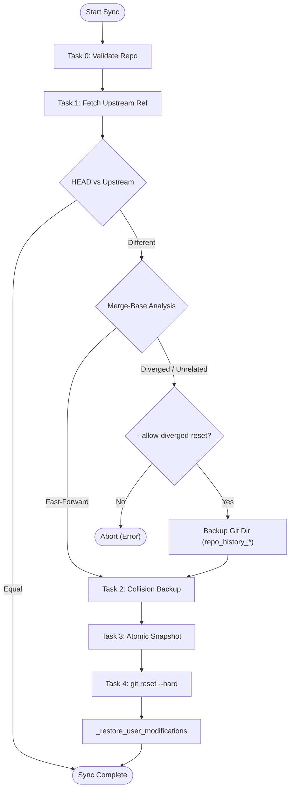
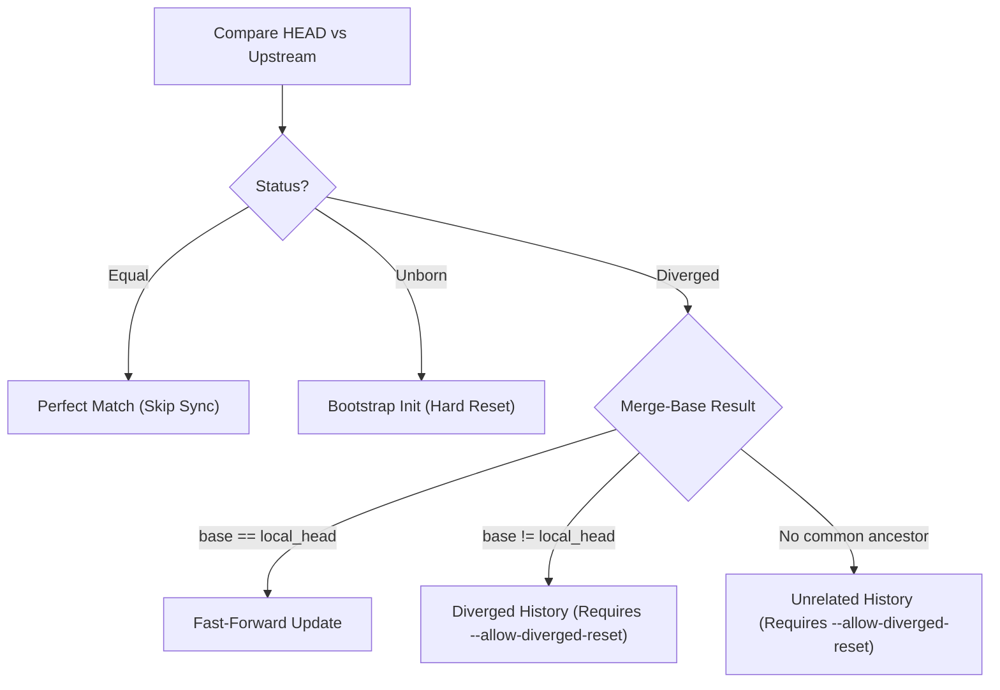
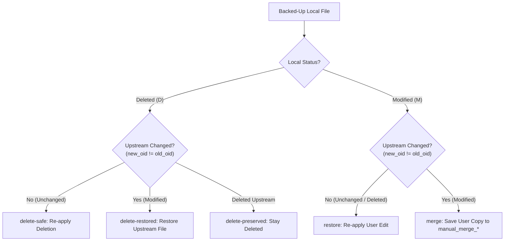

# Dusky Sync & Update Architecture

Reference guide for `update_dusky.py` synchronization mechanics, backup strategies, file restoration algorithms, and `once` execution markers.

---

## 1. Core Mechanics & Repo Layout

- **Work Tree (`WORK_TREE`)**: `~` ([user_home()](file:///home/dusk/user_scripts/update_dusky/python/update_dusky.py#L89))
- **Git Directory (`GIT_DIR`)**: `~/dusky` ([L2314](file:///home/dusk/user_scripts/update_dusky/python/update_dusky.py#L2314)) — Bare repository
- **Upstream Tracking Ref**: `refs/dusky-updater/upstream/<branch>` ([L3368](file:///home/dusk/user_scripts/update_dusky/python/update_dusky.py#L3368))

### The 5 Sync Tasks ([GitEngine.execute_phase: L3367](file:///home/dusk/user_scripts/update_dusky/python/update_dusky.py#L3367))

| Task | Name | Primary Function | Core Action |
| :---: | :--- | :--- | :--- |
| **0** | **Bare Repo Validation** | [_get_repo_state](file:///home/dusk/user_scripts/update_dusky/python/update_dusky.py#L2778) | Validates permissions & ownership. Clears stale locks (>60s). Auto-clones if absent. |
| **1** | **Fetch & Diff** | [_fetch_with_retry](file:///home/dusk/user_scripts/update_dusky/python/update_dusky.py#L2885) | Fetches upstream ref. Evaluates `merge-base` for fast-forward, diverged, or unrelated history. |
| **2** | **Collision Backup** | [_backup_worktree_collisions](file:///home/dusk/user_scripts/update_dusky/python/update_dusky.py#L2975) | Moves untracked work-tree files colliding with incoming tracked paths to `moved_aside_<ts>`. |
| **3** | **Atomic Snapshot** | [_capture_tracked_changes](file:///home/dusk/user_scripts/update_dusky/python/update_dusky.py#L3079) | Backs up local tracked edits/deletions (`diff-index HEAD`) to `your_changes_<ts>` with a `MANIFEST.txt`. |
| **4** | **Reset & Restore** | [_restore_user_modifications](file:///home/dusk/user_scripts/update_dusky/python/update_dusky.py#L3253) | Runs `git reset --hard`, then restores local changes or stages conflicts in `manual_merge_<ts>`. |

---

## 2. Sync Pipeline Flow



---

## 3. History Reconciliation & Safety



> [!IMPORTANT]
> **Safety Overrides for Diverged / Unrelated Histories**:
> - Aborts unless `--allow-diverged-reset` is passed ([L3513](file:///home/dusk/user_scripts/update_dusky/python/update_dusky.py#L3513)).
> - Preserves bare repo metadata in `repo_history_<timestamp>` ([L3208](file:///home/dusk/user_scripts/update_dusky/python/update_dusky.py#L3208)).
> - Creates full work-tree snapshot `full_snapshot_<timestamp>` for unrelated histories ([L3157](file:///home/dusk/user_scripts/update_dusky/python/update_dusky.py#L3157)).

---

## 4. File Restoration Decision Matrix

Post-reset, [_restore_user_modifications](file:///home/dusk/user_scripts/update_dusky/python/update_dusky.py#L3253) compares pre-reset state `(old_oid, old_mode)` with new upstream state `(new_oid, new_mode)`:



| Local Status | Upstream State | Action Code | Behavior | Work-Tree Result | Line |
| :---: | :---: | :---: | :--- | :--- | :---: |
| **Deleted** | Unchanged | `delete-safe` | Re-applies local deletion | Deleted | [L3293](file:///home/dusk/user_scripts/update_dusky/python/update_dusky.py#L3293) |
| **Deleted** | Also Deleted | `delete-preserved` | No-op (deleted on both sides) | Deleted | [L3290](file:///home/dusk/user_scripts/update_dusky/python/update_dusky.py#L3290) |
| **Deleted** | Modified | `delete-restored` | **Upstream wins** (overrides deletion) | Upstream file restored | [L3306](file:///home/dusk/user_scripts/update_dusky/python/update_dusky.py#L3306) |
| **Modified** | Unchanged | `restore` | Restores local modification | Local edited file | [L3333](file:///home/dusk/user_scripts/update_dusky/python/update_dusky.py#L3333) |
| **Modified** | Deleted | `restore` | Restores local edit (survives upstream drop) | Local untracked file | [L3285](file:///home/dusk/user_scripts/update_dusky/python/update_dusky.py#L3285) |
| **Modified** | Modified | `merge` | Upstream in work tree; user copy in `manual_merge_*` | Upstream version | [L3310](file:///home/dusk/user_scripts/update_dusky/python/update_dusky.py#L3310) |

---

## 5. Key Edge Cases & Takeaways

> [!WARNING]
> - **Deletion Resurrection**: If you delete a tracked file locally and upstream modifies it, upstream's version is restored (`delete-restored`).
> - **Survival Against Upstream Deletion**: If upstream deletes a file you edited locally, your version survives as an untracked file (`restore`).

- **Untracked Local Files**: Ignored by `reset --hard`. If upstream adds a file at the same path, Task 2 moves untracked path to `moved_aside_<timestamp>`.
- **Local-Only Tracked Files**: Removed by `reset --hard`. Preserved in `full_snapshot_<timestamp>` during unrelated history resets.

---

## 6. Backup Storage Strategy

Backups are saved under `~/.local/share/dusky/backups/` ([backups_dir(): L117](file:///home/dusk/user_scripts/update_dusky/python/update_dusky.py#L117)):

| Directory | Created By | Purpose | Retention |
| :--- | :--- | :--- | :--- |
| `moved_aside_<ts>` | Task 2 ([L3040](file:///home/dusk/user_scripts/update_dusky/python/update_dusky.py#L3040)) | Untracked work-tree collisions | Permanent |
| `your_changes_<ts>` | Task 3 ([L3126](file:///home/dusk/user_scripts/update_dusky/python/update_dusky.py#L3126)) | Pre-reset local tracked edits | Removed after restore |
| `full_snapshot_<ts>` | Task 3 ([L3171](file:///home/dusk/user_scripts/update_dusky/python/update_dusky.py#L3171)) | Full tracked tree snapshot (unrelated history) | Permanent |
| `repo_history_<ts>` | Task 1 ([L3216](file:///home/dusk/user_scripts/update_dusky/python/update_dusky.py#L3216)) | Copy of `~/dusky` bare repo before diverged reset | Permanent |
| `manual_merge_<ts>` | Task 4 ([L3313](file:///home/dusk/user_scripts/update_dusky/python/update_dusky.py#L3313)) | User versions conflicting with upstream updates | Permanent |

---

## 7. Script Execution Markers (`once` System)

The `OnceStore` class ([L797](file:///home/dusk/user_scripts/update_dusky/python/update_dusky.py#L797)) manages execution state using SQLite at `state_dir() / "once.db"` ([L799](file:///home/dusk/user_scripts/update_dusky/python/update_dusky.py#L799)). Unique marker keys are generated via [OnceStore.make_key](file:///home/dusk/user_scripts/update_dusky/python/update_dusky.py#L896) using a 16-byte `BLAKE2b` digest ([L916](file:///home/dusk/user_scripts/update_dusky/python/update_dusky.py#L916)) over key material (`once`, scope, profile, mode, task name, relative path, args).

```mermaid
stateDiagram-v2
    [*] --> Lookup
    Lookup --> Mode{"once_mode?"}
    
    Mode -- "forever" --> Skip["Action: skip (Never re-runs)"]
    Mode -- "sealed" --> SealedCheck{"Checksum modified?"}
    SealedCheck -- "No" --> Skip
    SealedCheck -- "Yes" --> Notify["Action: notify_sealed (Warn & Skip)"]
    
    Mode -- "content (default)" --> ContentCheck{"Checksum matches?"}
    ContentCheck -- "Match" --> Skip
    ContentCheck -- "Changed" --> Run["Action: run (Re-executes)"]
```

---

## 8. CLI Flags Summary

| Flag / Setting | Scope | Effect |
| :--- | :--- | :--- |
| `--allow-diverged-reset` | Sync Phase | Allows hard reset on diverged or unrelated history ([L3513](file:///home/dusk/user_scripts/update_dusky/python/update_dusky.py#L3513)). |
| `--skip-sync` | Entrypoint | Bypasses `GitEngine.execute_phase` completely. |
| `status.showUntrackedFiles` | Git Config | Set to `no` automatically by `_ensure_repo_defaults()` ([L2860](file:///home/dusk/user_scripts/update_dusky/python/update_dusky.py#L2860)). |
