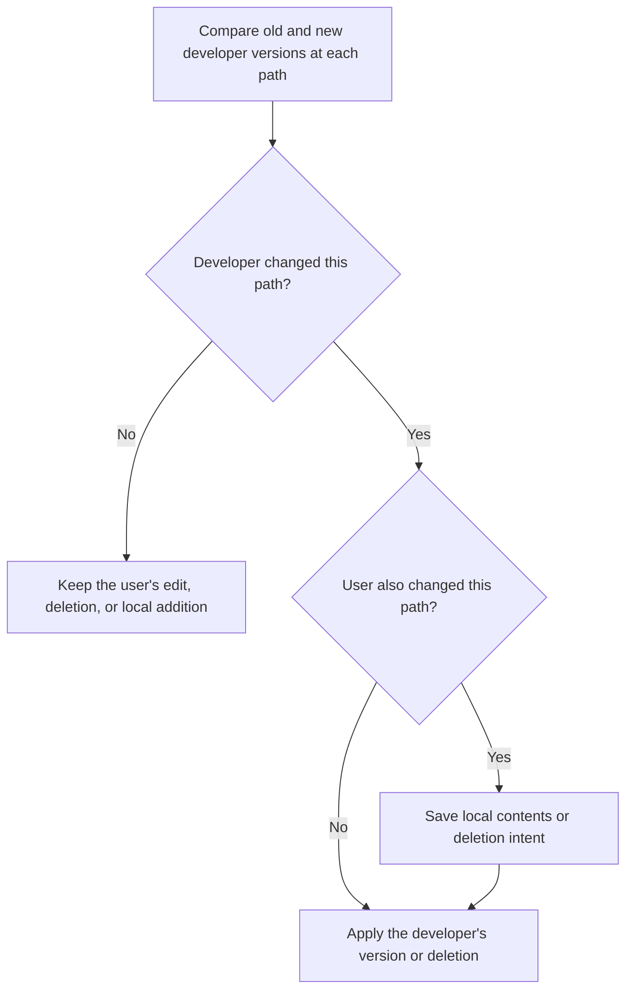
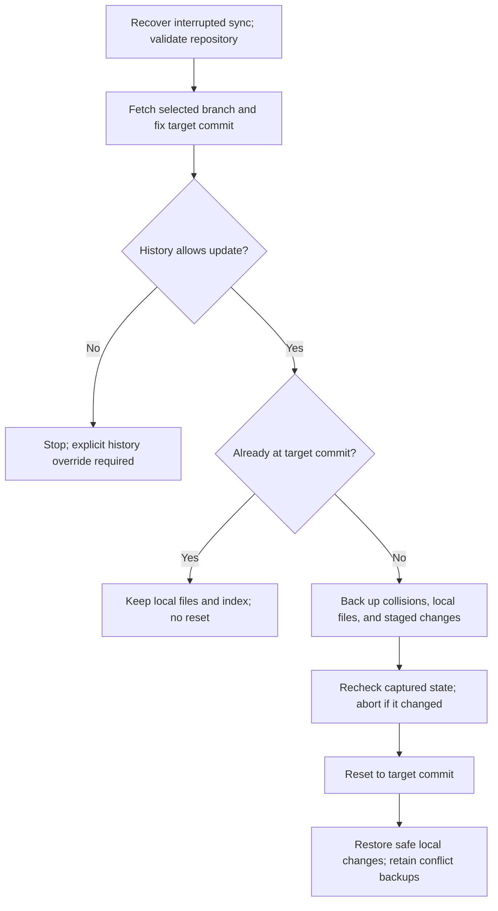

# Dusky Updater: Sync Behavior

This guide describes [update_dusky.py](update_dusky.py). **Developer** means the
version published on the selected upstream branch; **user** means local changes
on the user's machine. Rules below were checked against the code on 2026-10-03;
this is a behavior reference, not a claim that every case has been run in a VM.

## 1. The Main Rule

**Developer changes win at the same path. User changes survive when the
developer's version at that path is unchanged. Conflicting local files are
backed up, not combined automatically.**

“Unchanged” compares the old and new commit's file contents **and Git mode**.
An executable-bit or file-type change counts as a developer change too.

```mermaid
flowchart TD
    Start["Compare old and new developer versions at each path"] --> Changed{"Developer changed this path?"}
    Changed -- No --> Keep["Keep the user's edit, deletion, or local addition"]
    Changed -- Yes --> Local{"User also changed this path?"}
    Local -- No --> Apply["Apply the developer's version or deletion"]
    Local -- Yes --> Save["Save local contents or deletion intent"]
    Save --> Apply
```

## 2. File Conflict Chart

These rules apply to local working files during an ordinary update. Locally
committed changes follow the history rules in section 5.

| Developer action | User action | After updating |
| :--- | :--- | :--- |
| Edit a file | Leave it unchanged | Developer's whole file replaces it |
| Delete a file | Leave it unchanged | File is deleted |
| Edit a file | Edit the same file | Developer's whole file wins; user's copy is backed up |
| Delete a file | Edit the same file | File stays deleted; user's copy is backed up |
| Edit a file | Delete the same file | Developer's file returns; prior deletion is recorded |
| Delete a file | Delete the same file | File remains deleted |
| Add a file | Already have a local file at that path | Local file is backed up; developer's file wins |
| Leave a file unchanged | Edit it | User's edit survives |
| Leave a file unchanged | Delete it | User's deletion survives |
| Do not add a path | Add a local file there | User's file survives |
| Rename `A` to `B` | Edit `A` | User's `A` is backed up; developer's `B` is installed |
| Add a file or directory tree | Have an obstructing local file, directory, or symlink | Obstructing local paths are moved to backup before checkout |

A developer file reintroduced after a previous deletion is a new incoming file;
a past user deletion is not a permanent “never restore this filename” setting.
Unrelated local files are left alone unless they obstruct incoming paths.

## 3. Renames: Paths, Not File Identity

The updater captures local changes with rename detection disabled. It treats a
rename as **delete the old path + add the new path**, rather than following a
file's identity across names. This can leave two files after an update.

| Developer action | User action | After updating |
| :--- | :--- | :--- |
| Leave `A` unchanged | Rename `A` to `B` | `A` stays deleted; user's `B` remains |
| Edit `A` | Rename `A` to `B` | Developer's `A` returns; user's `B` remains |
| Delete `A` | Rename `A` to `B` | `A` stays deleted; user's `B` remains |
| Rename `A` to `C` | Rename `A` to `B` | Developer's `C` and user's `B` can both remain |
| Rename `A` to `B` | Already have a local `B` | Local `B` is backed up; developer's `B` wins |

Examples assume `B` and `C` are otherwise unrelated, unobstructed paths.
Staged renames also follow the staging rule below.

```mermaid
flowchart LR
    Before["User renames A to B"] --> Update["Developer edits A"]
    Update --> After["After update: developer's A + user's B"]
```

**Limitation:** developer-wins is a rule for matching paths. It does not remove
or replace a user's renamed copy at a different, untouched path.

## 4. Backups and Staging

Default location: `~/Documents/dusky_backups/` for the target user. Configure it
with `paths.documents_dir` and `paths.backups_subdir`. `<ts>` means a timestamp.

| Backup directory | What it contains |
| :--- | :--- |
| `your_changes_<ts>` | Local working files in `payload/`; deletion records, staged contents and recovery status in `.meta/` |
| `manual_merge_<ts>` | User versions displaced by developer edits or deletions; restore manually if wanted |
| `moved_aside_<ts>` | Local paths that obstructed incoming files, stored in `payload/` |
| `repo_history_<ts>` | Bare Git repository before an explicitly allowed history reset |
| `full_snapshot_<ts>` | Full tracked-tree backup before replacing unrelated history |

**Staged changes are saved, but staging is not automatically reapplied after a
reset.** The working file and staged version can differ; staged contents and
mode/deletion records are retained for manual recovery in `.meta/`.
If no reset is needed because the commits already match, staging stays intact.

Completed `your_changes_*` backups are kept until retention cleanup, normally
**14 days**. `paths.backup_retention_days = 0` disables that cleanup. Conflicts,
staged recovery, collisions, history backups and full snapshots are not
expired automatically.

Successful sync can still leave local conflicts requiring attention. Check the
warnings and `.meta/RESTORE_RESULT.txt` / `.meta/STATUS` in the local-change backup.
“Manual merge” is a backup name, not an automatic content merge.

## 5. Update Flow and History

The work tree defaults to the target user's home; the bare Git repository defaults
to `~/dusky`. Override them with `DUSKY_WORK_TREE` and `DUSKY_GIT_DIR`.

```mermaid
flowchart TD
    Start["Recover interrupted sync; validate repository"] --> Fetch["Fetch selected branch and fix target commit"]
    Fetch --> History{"History allows update?"}
    History -- No --> Stop["Stop; explicit history override required"]
    History -- Yes --> Equal{"Already at target commit?"}
    Equal -- Yes --> Keep["Keep local files and index; no reset"]
    Equal -- No --> Backup["Back up collisions, local files, and staged changes"]
    Backup --> Check["Recheck captured state; abort if it changed"]
    Check --> Reset["Reset to target commit"]
    Reset --> Restore["Restore safe local changes; retain conflict backups"]
```

| Repository history | Behavior |
| :--- | :--- |
| Same commit | No reset; local files and staging remain in place |
| Fast-forward update | Back up, apply developer version, then restore safe local changes |
| Local commits ahead, diverged, or unrelated | Stop unless `--allow-diverged-reset` is supplied; preserve repository history first |
| Unrelated history with override | Also take a full tracked-tree snapshot |
| Missing repository or no initial commit | Back up collisions and initialize; ordinary tracked-edit restoration does not apply |

Existing Git locks and in-progress Git operations stop sync. Git listing failures
abort instead of being treated as “nothing to back up.” A transaction journal
tracks interrupted work for recovery before another fetch. Filesystem recovery
is not a blanket guarantee that every task or entire update will be rolled back.

## 6. Options and Recovery

| Option | Effect |
| :--- | :--- |
| `--sync-only` | Sync files without running the profile's ordinary tasks |
| `--skip-sync` | Skip ordinary Git sync; invalid restart handoff can still require recovery sync |
| `--allow-diverged-reset` | Permit the history replacement described above |
| `execution.validate_subscript_syntax` | Optional task-script syntax checks; **off by default** |

`--sync-only` and `--skip-sync` cannot be combined. When syntax checking is enabled,
invalid task scripts remain on disk but their tasks are blocked with warnings.
The checker does not replace them with older scripts. Updater/profile/settings
activation checks are separate and still apply when task-script checks are off.

When updater, profile, or settings changes require a restart, a validated handoff
passes update state and the operation lock to the replacement process.
When launched through [update_dusky_supervisor.py](update_dusky_supervisor.py), a
candidate that fails before its startup-health checkpoint can be replaced with
a previously recorded known-good bundle. Ordinary task failures after that
checkpoint do not trigger this rollback. Direct Python launches do not provide
that external supervisor recovery.

Tasks with `once` markers follow their configured mode:

| Mode | When the task runs again |
| :--- | :--- |
| `content` (default) | Its checksum changes, or no successful marker exists |
| `forever` | Only when no successful marker exists |
| `sealed` | Only when no successful marker exists; content changes produce a notification instead |

A marker read error is reported as an error, not treated as a missing marker.
